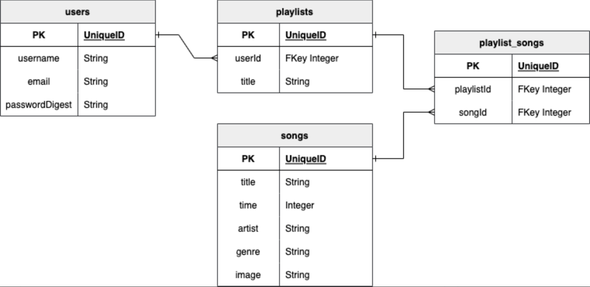

# Moosic

---

## Date: 8/10/2022 - 8/19/2022

---

### By: Emily Byrne, Patrick Knight, Tommy Le

[Emily Byrne](https://www.linkedin.com/in/emilybyrne3/) | [Patrick Knight](https://www.linkedin.com/in/patrick-f-knight/) | [Tommy Le](https://www.linkedin.com/in/tommyyle/)

---

### **_Links_**

[Moosic Frontend](https://github.com/pfknight8/Moosic_Frontend) | [Trello](https://trello.com/b/t17RUM3i/moosic) | [Backend Deployment](https://moosicbackend.herokuapp.com/)

---

### **_Description_**

Moosic, a music app where users are able to browse for songs as well as create playlists where they can add their favorite songs! 

---

### **_Technologies_**

* PostgreSQL
* Express
* React
* Node
* Deployed using Heroku

---
### **_Getting Started_**

- `Fork` & `Clone` this repository.
- `npm i` to install necessary dependencies.

#### Dependencies include Express, Cors/Morgan, Nodemon, Sequelize. These should already be in the package.json files, but will be good to make sure. Please make sure that your local machine has the proper installations for these, as well.

#### Remember that this repo is only the BACKEND portion of the Moosic project. The FRONTEND portion is availabla via the link provided above.

---

### **_Screenshots_**

#### Entity Relationship Diagram (ERD)

---

### **_Future Updates_**

- [X] ~~Link to Frontend~~

---

### **_Credits_**

* www.freecodecamp.org for 'PERN' logo
* Deployed with [Heroku](https://www.heroku.com/)